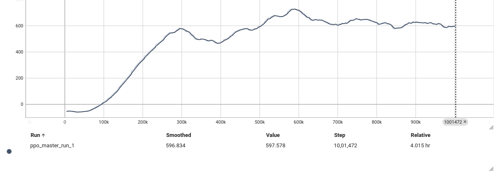

## Overview

An autonomous driving agent trained in `CarRacing-v3` relying purely on raw pixel data—no hardcoded physics, waypoints, or telemetry. 

The model is powered by Proximal Policy Optimization (PPO). PPO is great for continuous control because it clips the gradient updates, keeping the learning stable so the car doesn't randomly unlearn how to drive after a bad lap. 

**Technical Details:**
* **Frame Stacking:** 4 consecutive grayscale frames so the network natively tracks velocity.
* **Linear Annealing:** Decayed the learning rate and clip bounds to force convergence past early plateaus.
* **Zero Entropy:** Dropped entropy to exactly zero at the end to lock in a deterministic, tight racing line.

## Results

* **Training Time:** 1,000,000 timesteps
* **Peak Score:** 626
* **Architecture:** PPO (Stable-Baselines3) + Frame Stacking (4 frames)




https://github.com/user-attachments/assets/79b99d18-318c-4249-b179-e3c2d827148d


## Setup and Execution

Install dependencies:
```bash
pip install -r requirements.txt
```

To train the agent, run the script:
```bash
python train_master.py
```
This runs the full 1,000,000-step training loop and saves the highest-scoring model to ./models_clean/best_model/.

To watch it drive, run the script:
```bash
python test_master.py
```
This loads the trained model and drops an .mp4 of the agent completing a track lap directly into the ./video_master/ folder.
